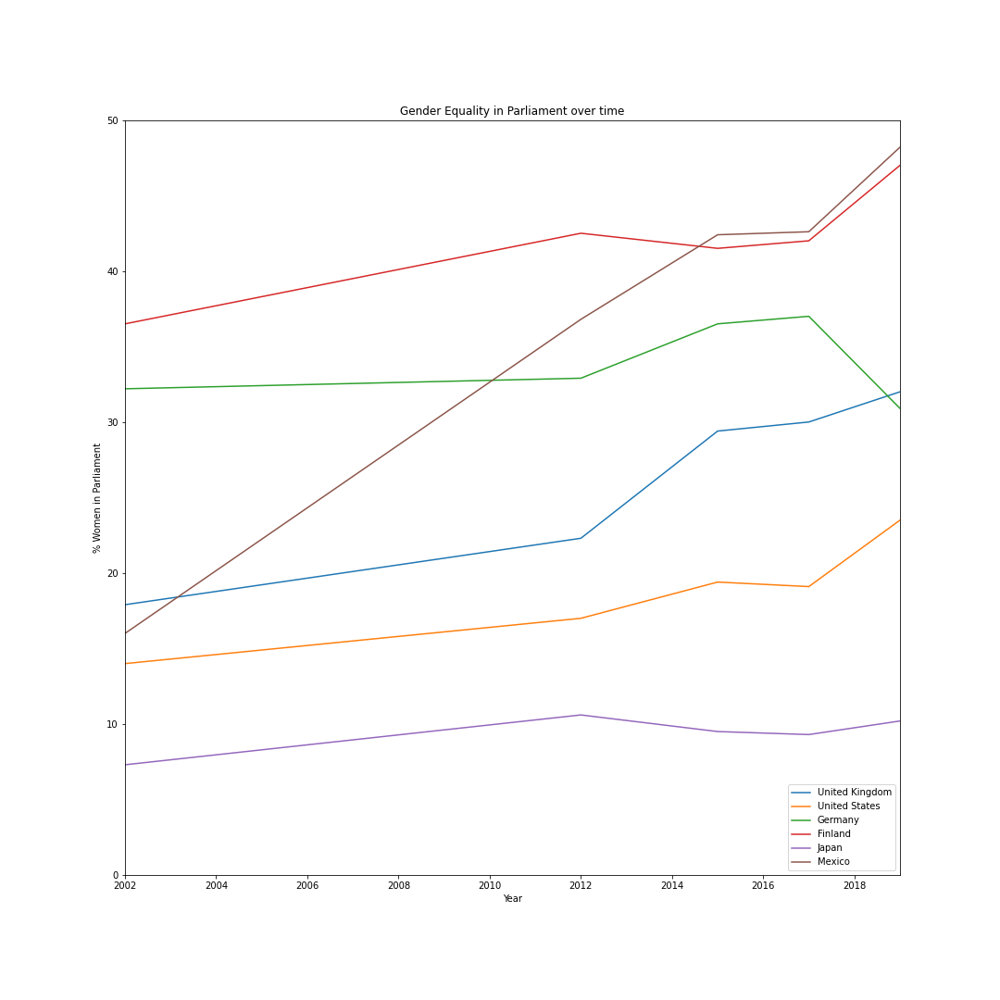

# r-e-s-p-e-c-t

## Data from OECD website:

[All OECD Gender Data](https://www.oecd.org/gender/data/)

[Gender equality in parliament data](https://stats.oecd.org/Index.aspx?QueryId=104391)

## Results 

#### Graph showing percentage of parliamentarians who are women by country (as of latest available data from 2019)
Points of note:
- Mexico and Costa Rica much higher than I would have expected, few articles here suggesting these stats aren't necessarily representative as the workplace is generally less equal than other countries and there are higher incidents of violence against women
   - [OECD: Gender Equality and the Empowerment of Women for Inclusive Growth in Mexico, 2020](https://www.oecd.org/about/secretary-general/gender-equality-and-empowerment-of-women-for-inclusive-growth-mexico-january-2020.htm)
   - [McKinsey: One aspiration, two realities: Promoting gender equality in Mexico, 2019](https://www.mckinsey.com/featured-insights/americas/one-aspiration-two-realities-promoting-gender-equality-in-mexico)

#### Graph for select countries showing change in percentage of parliamentarians who are women over time
Points of note:
- Movement in Mexico % suggests this may be anomolous / due to lack of available data
- I was aware Japan had low gender balance in business and politics but it's particularly disheartening to see there seems to be very little progress over time
- Germany - couldn't find any justification for the latest drop, intruiged what has caused this..

## Using Jupyter notebooks in VS Code
Followed guidance from here (just ran pip install jupyter):  
https://code.visualstudio.com/docs/python/jupyter-support

